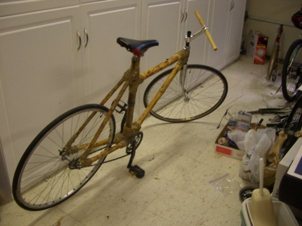

Title: Bamboo Bike
Date: 2013-09-05
Category: not software
tags: bicycles

In high school I built some bamboo bikes. The second one broke and I rebuilt it.

Here are their stories.

## v0.1

One day I was biking with my friend Chris. I said to him that we should build a
bamboo bike in the summer. He said that that was a great idea and that we should
do it.

When summer started we bummed for bike parts around Palo Alto.

Somebody gave us an old frame that had been in a crash.

We sawed the joints off.

Then we went to a bamboo garden in the hills and got some bamboo.

We heat-treated the bamboo, which both dries the bamboo and strengthens it. Then
we cut it into appropriate lengths and fit them onto the steel joints.

The bamboo was loose on the steel tubes, so we filled the space with expanding
foam. Then we mixed up some epoxy resin, soaked twine in it, and wrapped
that around the joints to strengthen them.

The final product had some pretty wonky geometry, which was totally
different from what we had laid out earlier:

The bottom bracket holder was very low to the ground, resulting in low ground
clearance. I had to be very careful to avoid pedal strike. I resolved to use a
jig the next time around.

## v0.2

The next summer, having learned many lessons, I built another bike.

I was happy enough to make an
[Instructable](http://www.instructables.com/id/Bamboo-Bike-Frame/) about the
build process.

I rode this daily for several months, then one day the bottom bracket joint
snapped as I was crossing a street. So I started thinking about the next one.

## v0.3

For this one I redid the joints that broke with carbon fiber:

First I tacked the joints back together. Then I built up the joints with
long-fiber Bondo, a two-part putty reinforced with fiberglass. I smoothed the
Bondo out with a Dremel, and started laminating the joint with carbon fiber.

I found a vacuum pump, made an air filter with activated charcoal and a metal
can, and bought some trash-bags. Then I was able to do some
[crude vacuum-bagging](http://ezinearticles.com/?Vacuum-Bagging-Carbon-Fiber-On-$50&id=674586)
of the joints.

As I waited for the epoxy to cure, I thought of a couple other ways I could have
joined the bamboo - forming the joints with smooth Bondo, using small bamboo
gussets, etc. The idea is to minimize the probability of kinks and air pockets
in the fiber by making the joint as smooth as possible. I'll have to test to see
which method works best.
